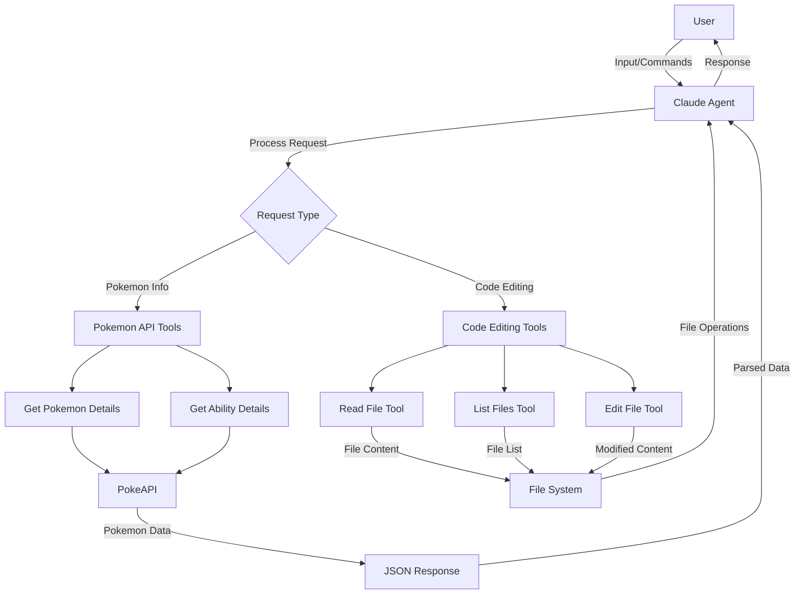

# Diagram

# Flow Claude Agent Interaction

```mermaid
graph TD
    A[User] -->|Input/Commands| B[Claude Agent]
    B -->|Process Request| C{Request Type}
    
    C -->|Code Editing| D[Code Editing Tools]
    C -->|Pokemon Info| E[Pokemon API Tools]
    
    D --> F[Read File Tool]
    D --> G[List Files Tool]
    D --> H[Edit File Tool]
    
    E --> I[Get Pokemon Details]
    E --> J[Get Ability Details]
    
    I --> K[PokeAPI]
    J --> K[PokeAPI]
    
    F -->|File Content| L[File System]
    G -->|File List| L
    H -->|Modified Content| L
    
    K -->|Pokemon Data| M[JSON Response]
    M -->|Parsed Data| B
    
    L -->|File Operations| B
    B -->|Response| A
```